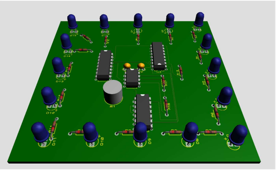
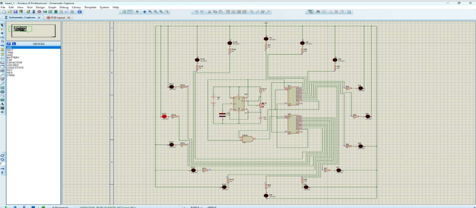
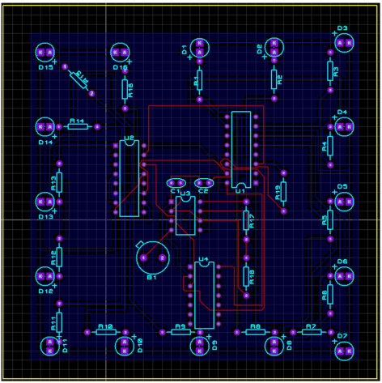

# 🔁 Mạch 16 LED Chạy Tuần Tự (Sequential LED Circuit)

## 📌 Giới thiệu
Đây là project **Thiết kế mạch 16 LED chạy tuần tự** sử dụng các IC logic cơ bản trong môn  
**Thực hành Điện tử số**.
### 👥 Group Members
- **Nguyễn Hồng Minh**
- Ngô Đức Huỳnh

Mạch hoạt động theo nguyên lý:
- LED **sáng lần lượt từng LED theo thứ tự**
- Khi đến LED cuối cùng, mạch **reset và lặp lại chu kỳ**
- Không sử dụng vi điều khiển

Project phù hợp cho:
- Sinh viên học **điện tử số**
- Người mới học **IC 555, CD4017**
- Tham khảo mạch LED chạy cơ bản, dễ triển khai thực tế

---

## 🧠 Nguyên lý hoạt động (Tóm tắt)
- **IC 555** hoạt động ở chế độ **Astable**, tạo xung clock
- Xung clock được đưa vào **IC CD4017**
- Hai IC CD4017 kết hợp với cổng AND **74LS08** để:
  - Điều khiển **16 LED chạy tuần tự**
  - Kiểm soát quá trình reset và dừng đếm đúng chu kỳ
- Mỗi xung clock → **1 LED sáng**

---

## 🧩 Linh kiện sử dụng

| Linh kiện | Số lượng |
|---------|----------|
| IC 555 | 1 |
| IC CD4017 | 2 |
| IC 74LS08 | 1 |
| LED | 16 |
| Điện trở 220Ω | 16 |
| Điện trở 10kΩ | 2 |
| Tụ 10µF | 1 |
| Tụ 10nF | 1 |
| Nguồn DC | 1 |

---
 ## PCB
 
